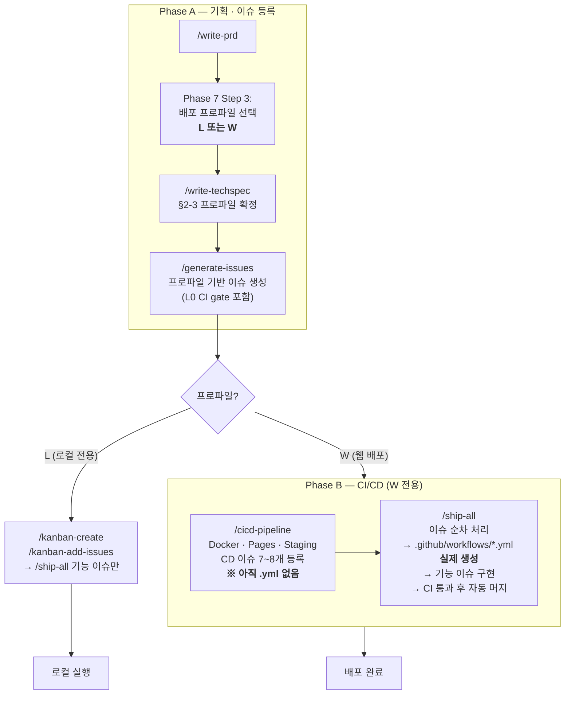
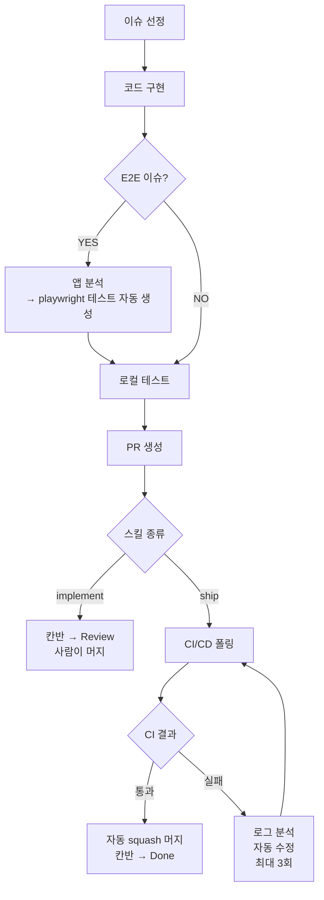
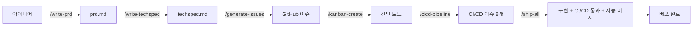

# go-sdlc — 소프트웨어 개발 자동화 Claude Code 스킬 패키지

소프트웨어 개발 전체 라이프사이클(기획 → 설계 → 이슈 관리 → 구현 → CI/CD)을 자동화하는 **Claude Code 커스텀 스킬** 7종 패키지입니다.

> **go-sdlc** = Go + Software Development Life Cycle

---

## 목차

1. [사전 준비](#1-사전-준비)
2. [설치](#2-설치)
3. [설치 확인](#3-설치-확인)
4. [스킬 상세 가이드](#4-스킬-상세-가이드)
   - [write-prd](#write-prd--prd제품-요구사항-문서-작성)
   - [write-techspec](#write-techspec--techspec기술-명세서-작성--이슈-발행)
   - [github-kanban](#github-kanban--칸반-보드-관리)
   - [ci-cd-pipeline](#ci-cd-pipeline--cicd-파이프라인-이슈-생성)
   - [tdd](#tdd--테스트-주도-개발-워크플로우)
   - [github-flow-impl](#github-flow-impl--이슈-구현--pr-생성)
   - [auto-ship](#auto-ship--이슈-구현--cicd-통과--자동-머지)
5. [스킬 비교](#5-스킬-비교)
6. [전체 워크플로우 예시](#6-전체-워크플로우-예시)
7. [제거](#7-제거)

---

## 1. 사전 준비

### 필수 도구

```bash
node --version   # v14 이상
claude --version # Claude Code CLI
gh --version     # GitHub CLI
jq --version     # JSON 처리 도구 (brew install jq)
```

### GitHub 인증

```bash
gh auth login
gh auth refresh -s repo -s project -s read:org -s read:discussion
```

### KANBAN_TOKEN 발급 (칸반 자동화 필수)

PR을 열거나 머지할 때 칸반 이슈가 자동으로 컬럼을 이동하려면 `KANBAN_TOKEN` PAT가 필요합니다.

> GitHub Actions 기본 `GITHUB_TOKEN`은 Projects V2에 접근할 수 없어 별도 PAT가 필요합니다.

**1단계 — PAT 발급** ([github.com/settings/tokens/new](https://github.com/settings/tokens/new))

| 항목 | 값 |
|------|---|
| Note | `kanban-automation` |
| Expiration | No expiration (교육용) 또는 90 days |
| Scopes | ✅ `repo` ✅ `project` ✅ `read:org` ✅ `read:discussion` |

**2단계 — 저장소 Secret 등록**

```bash
gh secret set KANBAN_TOKEN --repo OWNER/REPO
# 프롬프트에 ghp_... 토큰 붙여넣기
```

또는 웹 UI: `Settings → Secrets and variables → Actions → New repository secret`

> **미등록 시 graceful degradation**: 토큰이 없으면 칸반 이동이 스킵되지만 Actions 체크가 빨간 X로 실패하지는 않습니다. 토큰 등록 즉시 자동화가 활성화됩니다.

---

## 2. 설치

7개 스킬, 12개 커맨드가 설치됩니다. 설치 후 **Claude Code를 재시작**하세요.

### 전역 설치 (모든 프로젝트에서 사용)

```bash
npx github:ischung/go-sdlc                 # ~/.claude/ 에 설치
```

### 프로젝트 스코프 설치 (해당 프로젝트에서만 사용)

```bash
cd /your-project
npx github:ischung/go-sdlc --project       # 현재 디렉토리의 .claude/ 에 설치
npx github:ischung/go-sdlc --project /path # 지정 경로의 .claude/ 에 설치
```

| 스코프 | 설치 위치 | 언제 쓰나 |
|--------|-----------|-----------|
| 전역 (기본) | `~/.claude/` | 모든 프로젝트에서 동일 버전의 스킬을 쓸 때 |
| 프로젝트 (`--project`) | `<target>/.claude/` | 실습·팀별로 스킬 버전을 독립 유지하거나, 전역을 비워둔 채 특정 프로젝트에만 적용할 때 |

전역과 프로젝트 스코프 모두 설치되어 있으면 **프로젝트 스코프가 우선 적용**됩니다.

```
~/.claude/
├── skills/
│   ├── write-prd/SKILL.md
│   ├── write-techspec/SKILL.md
│   ├── github-kanban/SKILL.md
│   ├── ci-cd-pipeline/SKILL.md
│   ├── tdd/SKILL.md
│   ├── github-flow-impl/SKILL.md
│   └── auto-ship/SKILL.md
└── commands/
    ├── write-prd.md        → /write-prd
    ├── write-techspec.md   → /write-techspec
    ├── generate-issues.md  → /generate-issues
    ├── kanban-create.md    → /kanban-create
    ├── kanban-add-issues.md→ /kanban-add-issues
    ├── kanban-status.md    → /kanban-status
    ├── cicd-pipeline.md    → /cicd-pipeline
    ├── tdd.md              → /tdd
    ├── implement.md        → /implement
    ├── impl.md             → /impl
    ├── ship.md             → /ship
    └── ship-all.md         → /ship-all
```

---

## 3. 설치 확인

```bash
npx github:ischung/go-sdlc list              # 전역 설치 현황
npx github:ischung/go-sdlc list --project    # 현재 디렉토리의 프로젝트 설치 현황
```

---

## 4. 스킬 상세 가이드

### 권장 실행 순서

모든 스킬은 **기획 → 프로파일 결정 → 이슈 등록 → 자동 구현** 순서로 사용하도록 설계되어 있습니다. 핵심은 PRD Phase 7에서 결정되는 **배포 프로파일(L=로컬 전용 / W=웹 배포)** 이 TechSpec·이슈 발행·CI/CD 스킬 전 구간에 자동 전파된다는 점입니다. 프로파일 L은 Phase B(CI/CD 이슈 추가)를 건너뛰고 Phase B는 W일 때만 실행됩니다.



**왜 CI/CD가 2단계인가?**
`/cicd-pipeline`은 **"어떤 CI/CD가 필요한지"를 칸반 이슈로 분해**만 합니다 (문서화·설계 단계). 실제 `.github/workflows/*.yml` 파일은 `/ship-all`이 **L0 → L1 → L2 → L3 순서로 각 CI/CD 이슈를 처리할 때** 생성됩니다. 즉 CI/CD 구성도 일반 기능 이슈와 동일한 자동화 루프(구현 → PR → CI 검증 → 자동 머지)를 거칩니다.

**왜 프로파일을 미리 정하나?**
CI/CD 이슈 범위는 "로컬 프로젝트에 배포를 욱여넣지 않는다(YAGNI)"와 "웹 서비스에 CD가 빠진 채 기능만 쌓이지 않는다" 사이의 균형입니다. 프로파일을 한 번 정해두면 `/generate-issues`·`/cicd-pipeline`이 각자 자기 범위를 자동으로 좁히거나 넓히므로 "이게 끝인가?" 같은 임기응변 대화가 사라집니다.

**실행 요약 (복붙 순서)**

| 순서 | 커맨드 | 시점에서 생기는 것 | 프로파일 L | 프로파일 W |
|------|--------|--------------------|:---------:|:---------:|
| 1 | `/write-prd` (Phase 7 Step 3에서 L/W 선택) | `prd.md` | ✅ | ✅ |
| 2 | `/write-techspec` → `/generate-issues` | `techspec.md` + GitHub 기능 이슈 + L0 CI gate | ✅ | ✅ |
| 3 | `/kanban-create` → `/kanban-add-issues` | Projects V2 보드 · Todo 컬럼 배치 | ✅ | ✅ |
| 4 | `/cicd-pipeline` | **CD 이슈 7~8개 추가** (Docker·Pages·Staging; yml 파일은 아직 없음) | ⏭ 건너뜀 (가드 발동) | ✅ |
| 5 | `/ship-all` | L0 CI gate 포함 이슈부터 실제 yml 생성 → 기능 이슈 구현 → 자동 머지 | ✅ (L0 CI gate만) | ✅ (L0 CI gate + CD 전체) |

> 단일 이슈만 처리하려면 `/ship #N`(CI 통과·자동 머지) 또는 `/implement #N`(PR 생성까지, 사람이 머지)을 사용합니다.
> 프로파일이 중간에 바뀌면 `/write-techspec`으로 돌아가 §2-3을 갱신한 뒤 `/generate-issues`·`/cicd-pipeline`을 재실행하세요.

---

### `write-prd` — PRD(제품 요구사항 문서) 작성

**역할**: 시니어 PM 코치가 1:1 대화를 통해 PRD를 8단계로 완성합니다.

**커맨드**

```
/write-prd
```

자연어 트리거: `PRD 작성해줘`, `제품 기획서 만들어줘`

**진행 단계**

| Phase | 내용 | 산출물 |
|-------|------|--------|
| 0 | 아이디어 청취 — 만들고 싶은 것을 자유롭게 설명 | — |
| 1 | 프로젝트 목표 정의 — 해결하는 핵심 문제 | 목표 문장 |
| 2 | 범위 확정 — 이번 버전에서 할 것 / 하지 않을 것 | In-scope / Out-of-scope |
| 3 | 대상 사용자 & 유저 스토리 | Persona, User Story |
| 4 | KPI 정의 — 성공 기준 지표 | KPI 목록 |
| 5 | 상세 기능 요건 | 기능 목록 |
| 6 | UI/UX 요건 | 화면 흐름 |
| 7 | 기술적 제약 & 최종 저장 | `prd.md` |

각 단계마다 AI가 질문하고, 답변을 검토한 뒤 승인하면 다음 단계로 진행합니다.

---

### `write-techspec` — TechSpec(기술 명세서) 작성 + 이슈 발행

**역할**: PRD를 분석하여 TechSpec을 작성하고, AI가 즉시 구현할 수 있는 수준의 GitHub 이슈를 자동 발행합니다.

**커맨드**

```
/write-techspec     # TechSpec 작성
/generate-issues    # TechSpec → GitHub 이슈 자동 발행
```

자연어 트리거: `TechSpec 작성해줘`, `기술 명세서 만들어줘`, `이슈 발행해줘`

**TechSpec 포함 내용**

- 시스템 아키텍처 다이어그램 (Mermaid)
- 기술 스택 선택 근거
- 데이터 모델 및 ERD
- REST API 명세 (엔드포인트, 요청/응답 형식)
- 프론트엔드 / 백엔드 상세 기능 명세
- 개발 마일스톤 (Phase 1 ~ 4)

**`/generate-issues` 동작**

INVEST 원칙(Independent · Negotiable · Valuable · Estimable · Small · Testable)에 따라 작업 단위를 분할하여 GitHub 이슈를 생성합니다. 수락 기준(AC)이 포함된 이슈를 발행하므로 `/ship`이 바로 구현 가능한 상태로 만들어집니다.

**이슈 구조 (DAG 레벨)**

| 레벨 | 의미 | 담당 |
|------|------|------|
| **L0 — Walking Skeleton** | Hello World 수준이지만 전체 아키텍처를 관통하는 end-to-end 뼈대 | **고정 8항목** (Setup / DB / 인증 / 라우팅 / Frontend shell / 에러 핸들링 / CI-CD / 테스트 환경) |
| **L1 — Shared Primitives** | 엔티티 스키마, 공통 유틸 | 엔티티·유틸별 독립 병렬 |
| **L2 — Vertical Slice** | **"사용자가 …을 할 수 있다"** 단위로 DB + API + UI + Integration + Tests(Unit/Integration/Playwright E2E) 일체 | 슬라이스별 병렬 (독립 배포 가능) |
| **L3 — Cross-slice Integration** | 슬라이스 간 교차 시나리오 · 전역 UI | 시나리오별 병렬 |
| **L4 — Polish** | 문서, 접근성, 성능 | 완전 독립 |

**L2 Vertical Slice 강제 규칙**

- 제목은 반드시 `사용자가 …을 할 수 있다` 형식.
- `[Backend] 로그인 API`, `[Frontend] 로그인 화면` 같은 **계층 분리 이슈는 L2에 허용되지 않음**. 크기를 줄이려면 사용자 가치 자체를 더 작게 쪼갭니다.
- 모든 L2 이슈는 `@slice:<slug>` 태그가 붙은 **Playwright E2E 시나리오**를 보유 (per-PR CI Gate에서 실행).

**L0 종료 조건**: `홈 → /health` Playwright 시나리오가 통과해야 L1/L2로 진입 가능합니다.

---

### `github-kanban` — 칸반 보드 관리

**역할**: GitHub Projects를 활용한 칸반 보드 자동 구성 및 상태 조회.

**커맨드**

```
/kanban-create [프로젝트 이름]       # 보드 생성
/kanban-add-issues [프로젝트번호]    # 오픈 이슈를 Todo에 추가
/kanban-status [프로젝트번호]        # 현재 상태 조회
```

**보드 구조**

```
Todo → In Progress → Review → Done
```

- `Review`: `/implement`로 PR 생성 시 이동 (사람이 머지)
- `Done`: PR 머지 시 `kanban-auto-done.yml`이 자동 이동

**칸반 자동화 워크플로우**

최초 `/implement` 또는 `/ship` 실행 시 아래 3개 워크플로우 파일을 main 브랜치에 자동 커밋합니다.

| 파일 | 트리거 | 동작 |
|------|--------|------|
| `_kanban-move.yml` | (재사용 워크플로우) | 이슈를 지정 컬럼으로 이동 |
| `kanban-auto-review.yml` | PR 오픈 | 이슈 → Review |
| `kanban-auto-done.yml` | PR 머지 | 이슈 → Done |

> `KANBAN_TOKEN` 미등록 시 runtime guard로 graceful skip됩니다 (Actions 빨간 X 없음).

---

### `ci-cd-pipeline` — CI/CD 파이프라인 이슈 생성

**역할**: 프로젝트 아키텍처를 분석하여 GitHub Actions 기반 CI/CD 파이프라인 구축 이슈 7~8개를 DAG 구조로 자동 생성합니다(per-PR Playwright E2E 노드 3b 포함).

**커맨드**

```
/cicd-pipeline           # 이슈 생성 (실제 실행)
/cicd-pipeline --dry-run # 계획만 출력 (파일/이슈 생성 없음)
/cicd-pipeline --force   # 기존 cicd-issues.md 덮어쓰기
```

자연어 트리거: `CI/CD 파이프라인 만들어줘`, `GitHub Actions 설정해줘`

**Step 0 — 환경 감지**

실행 전 프로젝트를 분석하여 아래 항목을 파악합니다.

| 감지 항목 | 감지 방법 |
|-----------|----------|
| 언어/프레임워크 | `package.json`, `requirements.txt`, `go.mod` 등 |
| 기존 CI/CD 워크플로우 | `.github/workflows/` 파일 유무 |
| Unit/Integration Test | `jest.config`, `vitest.config`, `pytest.ini` 등 |
| Docker 설정 | `Dockerfile`, `docker-compose.yml` 유무 |
| E2E 테스트 프레임워크 | `playwright.config`, `cypress.config` 유무 |
| **E2E가 CI에 포함됨** | CI yml에 `test:e2e` / `playwright` 키워드 여부 |
| **E2E webServer 대상** | `playwright.config`의 `webServer.url`이 실제 앱인지 목업 HTML인지 |

**생성 이슈 구조 (DAG)**

```
Push / PR
  └─ [L1] Static Analysis + Security Scan           ┐
  └─ [L1] Unit/Integration Test CI Gate              │ 서로 독립 — 병렬 구현 가능
  └─ [L1] Playwright E2E on PR (slice별)            ┘ ← 매 PR 필수 status check
              └─ [L2] Docker Build & Push              ┐ 서로 독립 — 병렬 구현 가능
              └─ [L2] GitHub Pages + Smoke Test        ┘
                          └─ [L3] Container Security Scan           ┐ 서로 독립 — 병렬 구현 가능
                          └─ [L3] Staging 배포 + 스모크성 E2E 재실행 ┘
```

같은 `[Ln]` 접두어를 가진 이슈는 서로 의존하지 않으므로 **팀원이 나눠서 동시에 구현**할 수 있습니다.

> **노드 3b (Playwright E2E on PR)**: 매 PR에서 브랜치명 `feature/slice-<slug>` 또는 라벨 `slice/<slug>`에서 슬라이스 ID를 추출해 `@slice:<slug>` 태그가 붙은 시나리오만 실행합니다. 크로스 브라우저(Chromium/Firefox/WebKit) 매트릭스, 10분 병렬 worker, 실패 시 screenshot+video+trace 아티팩트 업로드. 노드 6(Staging)은 `@smoke` 태그 시나리오만 재실행하여 중복을 피합니다.

**E2E 안전장치 (Step 0 감지 → 노드 3b 이슈 본문 자동 반영)**

| 감지 결과 | 노드 3b 이슈에 자동 추가되는 지침 |
|-----------|--------------------------------|
| CI에 E2E 단계 없음 | `npm run build → playwright install → npm run test:e2e` 추가 지침 |
| `webServer`가 목업 HTML 대상 | 실제 devServer(`localhost:5173`)로 교체 지침 |
| `e2e/public/*.html` 목업 파일 존재 | 목업 파일 제거/이동 및 webServer 교체 지침 |
| E2E 자체 없음 | Playwright 설치 및 기본 테스트 스크립트 생성 지침. L0-8 Walking Skeleton 이슈가 이미 있으면 그 위에 PR-트리거 워크플로우·브라우저 매트릭스만 추가 |

> **비유**: CI 파이프라인 이슈를 생성하면서, E2E 테스트가 가짜 페이지를 검사하고 있는 문제를 미리 감지하여 **노드 3b**(PR 단계) 이슈에 수정 지침을 담아줍니다.

**실행 시점 권장**: 칸반 보드 생성 직후, 첫 `/implement` 이전 (Shift Left 원칙)

---

### `tdd` — 테스트 주도 개발 워크플로우

**역할**: Red → Green → Refactor 사이클을 단계별로 안내하는 TDD 페어 프로그래밍 파트너.

**커맨드**

```
/tdd 로그인 기능 구현
/tdd TimerDisplay 컴포넌트
```

자연어 트리거: `TDD로 구현해줘`, `테스트 먼저 짜줘`, `Red-Green-Refactor 해줘`

**진행 단계**

| 단계 | 내용 | 핵심 원칙 |
|------|------|-----------|
| STEP 0 (TODO) | 구현할 기능을 테스트 케이스 목록으로 분해 | 가장 단순한 케이스부터 |
| STEP 1 (RED) | 실패하는 테스트 작성 | AAA 패턴(Arrange · Act · Assert) |
| STEP 2 (GREEN) | 테스트를 통과하는 **최소한의** 코드 작성 | 과도한 최적화 금지 |
| STEP 3 (REFACTOR) | 동작을 유지하면서 코드 품질 개선 | 중복 제거, 명확한 네이밍 |

> `/ship` 내부에서도 활용됩니다. CI Gate에서 단위 테스트가 실패할 경우 TDD 사이클로 문제를 진단합니다.

---

### `github-flow-impl` — 이슈 구현 + PR 생성

**역할**: 칸반 보드 이슈를 선택하여 GitHub Flow 방식으로 구현하고 PR을 생성합니다. CI/CD 모니터링 없이 **PR 생성에서 종료**합니다.

**커맨드**

```
/implement              # Todo 최상단 이슈 자동 선택
/implement #42          # 이슈 번호 직접 지정
/implement --inline     # 이슈 내용 직접 입력 (보드 없이도 사용 가능)
/impl                   # /implement 단축어
```

**실행 흐름**

```
Step 0    환경 감지 (OWNER, REPO, PROJECT_NUMBER, DEFAULT_BRANCH)
Step 0.5  칸반 자동화 워크플로우 설정 (최초 1회)
Step 0.6  칸반 자동화 사전 점검 (KANBAN_TOKEN + 워크플로우 파일 확인)
Step 1    이슈 선정 (자동 선택 / 번호 지정 / 직접 입력)
Step 2    칸반 이동: Todo → In Progress + 담당자(@me) 할당
Step 3    브랜치 생성: feature/issue-42-이슈-제목
Step 4    코드 구현
  └─ Step 4-0  E2E 이슈 감지 시 앱 분석 → playwright 테스트 자동 생성 (↓ 상세)
  └─ Step 4-1  일반 구현 (AC 또는 이슈 설명 기준)
Step 5    로컬 테스트 (npm run build + npm test)
Step 6    PR 생성 + 칸반 이동: In Progress → Review
Step 7    완료 보고 ("PR 머지 시 Done 자동 이동")
```

**Step 4-0 — E2E 테스트 자동 생성**

다음 중 하나라도 해당하면 자동 실행: ① 이슈 제목/본문/라벨에 `e2e`, `playwright`, `cypress`, `end-to-end` 포함 ② **라벨에 `level/L2` 또는 `slice/*`가 부착됨** (L2 Vertical Slice 이슈는 모두 Playwright E2E 시나리오를 보유하므로 키워드 없이도 강제 진입).

| 분석 항목 | 방법 |
|-----------|------|
| ① dev 서버 명령·포트 | `package.json scripts.dev` 추출, 포트 우선순위: `--port` > `PORT=` > Vite(5173) > CRA(3000) |
| ② React Router 라우트 | `src/`에서 `path=` 및 `createBrowserRouter` 추출 |
| ③ CRUD/인증 컴포넌트 | `src/pages/`, `src/views/`에서 Create/List/Edit/Delete/Login/Auth 감지 |
| ④ 기존 E2E 설정 | `playwright.config.ts` 및 기존 spec 파일 확인 |

분석 결과로 자동 생성되는 파일:

| 파일 | 내용 |
|------|------|
| `playwright.config.ts` | `webServer`를 실제 앱 devServer로 설정 |
| `tests/e2e/app.spec.ts` | 메인 로딩, 라우트 접근성, CRUD/인증 플로우 시나리오 |
| `package.json` | `"test:e2e": "playwright test"` 스크립트 추가 |
| `.github/workflows/ci.yml` | Build → Playwright install → E2E 단계 추가 |

**최소 테스트 시나리오**

| 조건 | 시나리오 |
|------|---------|
| 항상 | 메인 페이지 로딩 (`/` 접속 후 타이틀 존재 확인) |
| 항상 | 라우트 접근성 (감지된 path 목록, 404 아님 확인) |
| CRUD 감지 시 | 목록 → 생성 버튼 → 폼 표시 확인 |
| 인증 감지 시 | 로그인 UI(입력 필드, 제출 버튼) 확인 |

> **핵심 원칙**: E2E는 반드시 실제 앱(React/Vue 등 devServer)을 대상으로 합니다. 바닐라 JS 목업 HTML을 대상으로 하는 E2E는 실제 앱의 런타임 오류를 검출할 수 없으므로 허용하지 않습니다.

---

### `auto-ship` — 이슈 구현 + CI/CD 통과 + 자동 머지

**역할**: `/implement`가 PR 생성에서 멈추는 것과 달리, CI/CD 파이프라인 통과 후 자동 머지까지 책임집니다. 실패 로그를 읽고 스스로 수정하는 피드백 루프를 내장합니다.

**커맨드**

```
/ship               # Todo 최상단 이슈 자동 선택
/ship #42           # 이슈 번호 직접 지정
/ship-all           # Todo 이슈 전체를 DAG 순서로 일괄 처리
/ship-all --skip #7 # 이슈 #7을 건너뛰고 나머지 처리
```

#### `/ship` 실행 흐름

```
Step 0    환경 감지 (OWNER, REPO, PROJECT_NUMBER, DEFAULT_BRANCH)
Step 0.5  칸반 자동화 워크플로우 확인/설정
Step 1    이슈 선정 (자동 or 번호 지정)
Step 2    칸반 이동: Todo → In Progress + 담당자 할당
Step 3    브랜치 생성: feature/issue-42-이슈-제목
Step 4    코드 구현
  └─ Step 4-0  E2E 이슈 → 앱 분석 + playwright 테스트 자동 생성
  └─ Step 4-1  일반 구현 (AC 기준)
Step 5    로컬 테스트 (npm run build + npm test)
Step 6    PR 생성 (※ Review 칸반 이동 없음 — 자동 머지까지 진행)
Step 7    CI/CD 모니터링 루프  ← ship의 핵심
  └─ CI 없으면 → Step 8로 스킵
  └─ CI 있으면 → 30초 간격 폴링
       ├─ 통과 → Step 8
       └─ 실패 → 피드백 루프 (최대 3회)
Step 8    자동 squash 머지 + 완료 보고
          → kanban-auto-done.yml이 Done 자동 이동
```

#### CI/CD 피드백 루프 (Step 7.4)

실패 시 로그를 분석하여 아래 패턴을 우선 진단하고 자동 수정합니다.

| 패턴 | 감지 방법 | 자동 수정 |
|------|-----------|----------|
| `package-lock.json` 없음 | 로그: "Dependencies lock file is not found" | `npm install` 후 커밋 |
| CI에 E2E 단계 누락 | CI yml에 `test:e2e`/`playwright` 없음 | Build → E2E 단계 추가 |
| E2E가 목업 HTML 대상 | `webServer` 없거나 `file://` URL, 또는 `e2e/public/*.html` 존재 | `playwright.config` webServer를 실제 devServer로 교체 |
| Build 없이 E2E 실행 | CI yml에서 E2E가 Build 이전 위치 | E2E 단계를 Build 이후로 이동 |
| import/모듈 누락 | 로그: "Cannot find module", "is not defined" | 해당 파일의 import 구문 추가 |
| 일반 테스트 실패 | 로그의 Error/FAIL 키워드 + 스택 트레이스 | 소스 파일 수정 후 재시도 |

> **우선순위**: E2E 구조 문제(파이프라인/설정)는 소스 코드 버그보다 먼저 수정합니다.

수정 후 `git push --force-with-lease`로 재push → CI 재실행. 3회 초과 실패 시 사용자에게 수동 개입 요청.

#### `/ship-all` 실행 흐름

`/ship`의 모든 단계를 이슈마다 반복하되, 앞에 계획 단계가 추가됩니다.

```
[사전 점검]
  → Todo 이슈 전체 조회
  → DAG 레벨 분석:
       [L0] 접두어 → 레벨 0 (CI/CD 정리, 최우선)
       [L1] 접두어 → 레벨 1 (CI 게이트)
       [L2] 접두어 → 레벨 2 (CD 진입)
       [L3] 접두어 → 레벨 3 (CD 후처리)
       접두어 없음  → 레벨 99 (기능 이슈)
  → 처리 계획 출력 후 실행

[순차 처리] 레벨 오름차순, 동일 레벨은 position 순
  이슈마다 Step 1~8 완전 실행

[최종 보고]
  ✔ 성공 N개 / ⚠ 실패 M개 / ⏭ 건너뜀 K개
```

#### `/implement` vs `/ship` 비교

| 기능 | `/implement` | `/ship` |
|------|:-----------:|:-------:|
| 브랜치 생성 | ✅ | ✅ |
| E2E 테스트 자동 생성 | ✅ | ✅ |
| 로컬 테스트 | ✅ | ✅ |
| PR 생성 | ✅ | ✅ |
| 칸반 Review 이동 | ✅ | ❌ (자동 머지까지 가므로) |
| CI/CD 모니터링 | ❌ | ✅ |
| 실패 로그 자동 분석 | ❌ | ✅ |
| 자동 수정 재시도 | ❌ | ✅ (최대 3회) |
| 자동 squash 머지 | ❌ | ✅ |
| 머지 후 칸반 Done | GitHub Action | GitHub Action |

> **언제 어떤 걸 쓸까?**
> - 코드 리뷰가 필요한 팀 프로젝트 → `/implement` (Review 단계 거침)
> - CI/CD까지 자동으로 끝내고 싶을 때 → `/ship` (자동 머지)
> - 백로그를 한번에 처리할 때 → `/ship-all`

---

## 5. 스킬 비교



---

## 6. 전체 워크플로우 예시



**단계별 실행 순서**

```
1단계: /write-prd          → 기획 문서(prd.md) 완성
2단계: /write-techspec     → 기술 명세서 완성
3단계: /generate-issues    → GitHub 이슈 자동 등록
4단계: /kanban-create      → 칸반 보드 생성
5단계: /kanban-add-issues  → 이슈를 보드 Todo에 배치
6단계: /cicd-pipeline      → CI/CD 파이프라인 이슈 8개 생성
7단계: /ship-all           → [L0]→[L1]→[L2]→[L3]→기능 이슈 순서로 전체 자동화
       /ship               → 단일 이슈 CI/CD 통과 + 자동 머지
       /implement          → 단일 이슈 PR 생성까지 (사람이 리뷰 후 머지)
       /tdd                → 각 기능을 TDD로 검증
```

---

## 7. 제거

```bash
# 전역 제거
npx github:ischung/go-sdlc uninstall

# 프로젝트 스코프 제거 (현재 디렉토리)
npx github:ischung/go-sdlc uninstall --project

# 프로젝트 스코프 제거 (지정 경로)
npx github:ischung/go-sdlc uninstall --project /path
```

제거 후 Claude Code를 재시작하면 스킬이 비활성화됩니다.

---

## 포함된 스킬 (7종)

| 스킬 | 커맨드 | 한 줄 설명 |
|------|--------|-----------|
| **write-prd** | `/write-prd` | 시니어 PM 코치가 1:1 대화로 PRD 8단계 완성 |
| **write-techspec** | `/write-techspec` `/generate-issues` | PRD → TechSpec 작성 + Walking Skeleton · Vertical Slice · per-PR Playwright E2E 구조로 이슈 자동 발행 |
| **github-kanban** | `/kanban-create` `/kanban-add-issues` `/kanban-status` | GitHub Projects 칸반 보드 자동 구성 및 조회 |
| **ci-cd-pipeline** | `/cicd-pipeline` | per-PR Playwright E2E(노드 3b) + 스모크성 재실행 포함, 8개 이슈 DAG 구조로 자동 생성 |
| **tdd** | `/tdd` | Red→Green→Refactor 사이클 TDD 페어 프로그래밍 |
| **github-flow-impl** | `/implement` `/impl` | 이슈 구현 → PR 생성 (E2E 이슈 시 테스트 자동 생성 포함) |
| **auto-ship** | `/ship` `/ship-all` | 구현 + CI/CD 피드백 루프 + 자동 squash 머지 end-to-end 자동화 |

---

## 지원 도구 로드맵

| 도구 | 상태 |
|------|------|
| Claude Code | ✅ 지원 |
| OpenAI Codex CLI | 🔜 예정 |
| GitHub Copilot CLI | 🔜 예정 |
